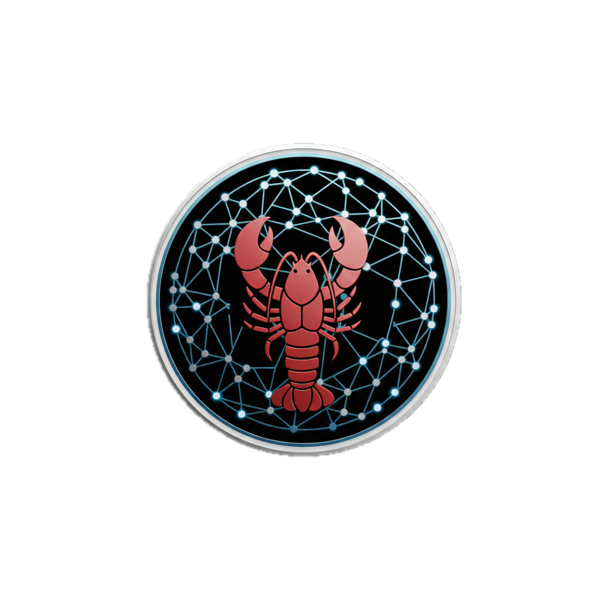

<p align="center">
  
</p>

<h1 align="center">Clawbernetes</h1>

<p align="center">
  <strong>AI-Native Workload Orchestration Platform</strong><br>
  Deploy, manage, and orchestrate workloads across any infrastructure using natural language.
</p>

<p align="center">
  <a href="https://github.com/clawbernetes/clawbernetes/actions/workflows/ci.yml">
    
  </a>
  <a href="https://opensource.org/licenses/MIT">
    
  </a>
  <a href="https://www.rust-lang.org/">
    
  </a>
  
  
</p>

---

## What is Clawbernetes?

Clawbernetes turns your machines into a cluster you can talk to. Instead of writing config files, you tell an AI agent what you want — deploy a service, run a batch job, manage secrets — and it handles the rest. It runs any workload across any number of machines, with first-class support for AI/ML workflows and GPU acceleration.

## Quick Start

### Prerequisites

- **Node.js 20+** — needed for OpenClaw and the plugin
- **Rust 1.85+** — needed to build Clawbernetes
- **Docker** (optional) — for running containerized workloads
- GPU drivers (optional) — for GPU acceleration (NVIDIA, AMD, or Apple Silicon)

### 1. Install OpenClaw

[OpenClaw](https://github.com/openclaw/openclaw) is the AI runtime that powers the agent. It gives you a web UI, chat interfaces (Slack, Discord, WhatsApp, CLI), and the brains behind the operation.

```bash
npm install -g openclaw
```

### 2. Build Clawbernetes

```bash
git clone https://github.com/clawbernetes/clawbernetes
cd clawbernetes
make build
```

Then install the plugin and start everything:

```bash
# Install the OpenClaw plugin
cd plugin/openclaw-clawbernetes
npm install && npm run build
openclaw plugins install -l .
openclaw plugins enable clawbernetes

# Start the gateway and connect this machine
cd ../..
./target/release/claw-gateway &
./target/release/clawnode --gateway ws://localhost:8080 --name my-machine &
```

### 3. Talk to it

```bash
openclaw gateway --verbose
```

Open the OpenClaw web interface. Your cluster is live.

## Try It Out

Here's what a conversation looks like:

```
You:   "What do I have?"
Agent:  Fleet status: 1 node (my-machine), healthy.
        GPUs: 1x NVIDIA RTX 4090 (24GB VRAM, 2% utilization, 38C).
        No running workloads.

You:   "Run a pytorch training container with 1 GPU"
Agent:  Deployed pytorch/pytorch:2.4-cuda12.4 to my-machine.
        Workload ID: a3f8c2. 1 GPU allocated.

You:   "How's it doing?"
Agent:  Workload a3f8c2 running. GPU utilization 94%, temp 71C, memory 18.2/24GB.
```

No YAML, no kubectl, no dashboards. Just say what you need.

## Add More Machines

Every machine runs `clawnode` and connects to your gateway:

```bash
./clawnode --gateway ws://gateway-ip:8080 --name gpu-server-2
```

That's it. The agent sees all connected machines and picks the best one when you deploy something.

## Try with Docker

Don't want to install anything? Spin up a test cluster in containers:

```bash
make docker-up    # gateway + 2 simulated nodes
make docker-logs  # watch them connect
make docker-down  # tear down
```

## Learn More

| Topic | Link |
|-------|------|
| Example conversations | [docs/use-cases.md](docs/use-cases.md) |
| System architecture | [docs/architecture.md](docs/architecture.md) |
| Configuration reference | [docs/configuration.md](docs/configuration.md) |
| Docker deployment | [docs/docker.md](docs/docker.md) |
| Agent skills | [docs/skills.md](docs/skills.md) |
| Building & testing | [docs/development.md](docs/development.md) |
| Operator guide | [docs/user-guide.md](docs/user-guide.md) |
| CLI commands | [docs/cli-reference.md](docs/cli-reference.md) |
| Security & RBAC | [docs/security.md](docs/security.md) |
| MOLT marketplace | [docs/molt-network.md](docs/molt-network.md) |
| WireGuard networking | [docs/wireguard-integration.md](docs/wireguard-integration.md) |
| Tailscale networking | [docs/tailscale-integration.md](docs/tailscale-integration.md) |
| GPU compute (CubeCL) | [docs/cubecl-integration.md](docs/cubecl-integration.md) |
| API docs | [docs/api/README.md](docs/api/README.md) |

## Contributing

We welcome contributions. See [CONTRIBUTING.md](CONTRIBUTING.md) for the full guide.

1. Fork the repo
2. Create a feature branch
3. Write tests, then code
4. Run `make check`
5. Open a pull request

## License

[MIT](LICENSE-MIT)

## Acknowledgments

- [OpenClaw](https://github.com/openclaw/openclaw) — Agent runtime
- [CubeCL](https://github.com/tracel-ai/cubecl) — Multi-platform GPU compute
- [WireGuard](https://wireguard.com) — Modern VPN protocol
- [Tailscale](https://tailscale.com) — Managed mesh networking

---

<p align="center">
  <a href="https://discord.gg/clawbernetes">Discord</a> &bull;
  <a href="https://twitter.com/clawbernetes">Twitter</a> &bull;
  <a href="https://clawbernetes.dev">Website</a>
</p>
